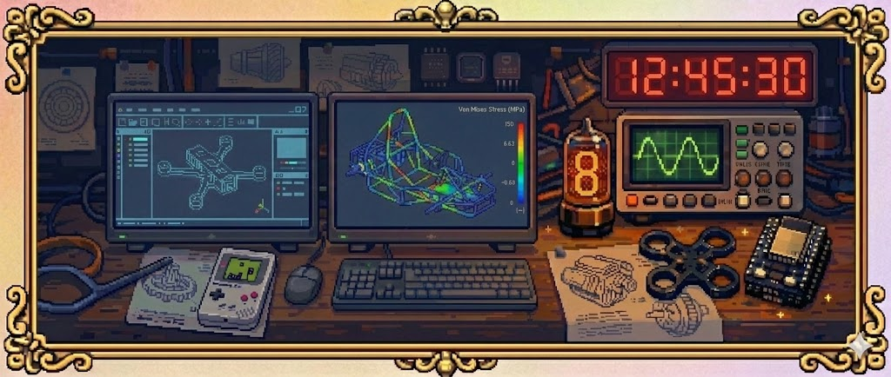

  

<h3 align="center">
  
</h3>

---

### Hi there 👋

## About Me
- I’m a **dual-degree engineering undergraduate** (Mechanical @ NIT Calicut, Electronic Systems @ IIT Madras)
- Interested in **embedded systems, simulation-driven design, and reverse engineering**
- I enjoy building **hardware-first projects** where mechanics, electronics, and software intersect
- Currently improving depth in **real-world engineering workflows and open-source projects**

---

## Socials

---

## Tech Stack

### Programming & Embedded

### Design & Simulation

### Systems & Tools

---

## GitHub Stats
 
 

---

## GitHub Trophies

---

### Quote

---

  

