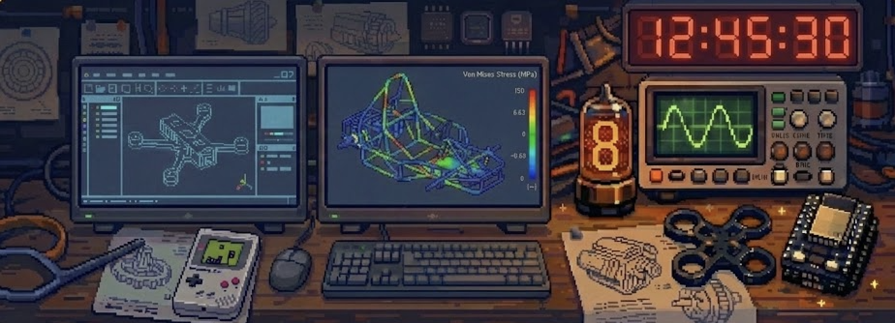

  

  

---

<pre>
┌────────────────────────────────────────────────────────────────────────┐
│  SYSTEM STATUS : ONLINE                                                │
├────────────────────────────────────────────────────────────────────────┤
│  OPERATOR      : Puneeth Shetty (Croionxx)                             │
│  MODE          : Dual-Degree Engineering                               │
│  AFFILIATION   : NIT Calicut (Mech) / IIT Madras (Electronic Systems)  │
│  TEAM          : Team Unwired (Formula Student)                        │
│  CURRENT FOCUS : Hardware-in-the-Loop & Embedded Systems               │
│  UPTIME        : ∞                                                     │
└────────────────────────────────────────────────────────────────────────┘
</pre>

---

### ⧉ MISSION PROFILE

I operate at the hard limit between **Mechanical Design** and **Embedded Electronics**. I don't just design the chassis; I wire the sensors that monitor it.

* **Philosophy:** Hardware does not lie. Simulations must earn trust.
* **Specialty:** Designing constraints-driven systems, from **Formula Student race cars** to **Solid Rocket Motors**.
* **Method:** Bench-test reality → Reverse engineer anomalies → Iterate.

---

###  TOOLCHAIN

| **EMBEDDED / FIRMWARE** | **DESIGN / SIMULATION** | **SYSTEMS / OS** |
|:---:|:---:|:---:|
|        |        |        |

---

###  PROJECT GALLERY

<table border="0">
  <tr>
    <td width="50%" align="center">
      <b>🏎️ Formula Student Chassis</b> 
       
      
        
      Designing and simulating tubular spaceframes for <i>Team Unwired</i>. Focus on torsional rigidity and crash safety analysis in ANSYS.
    </td>
    <td width="50%" align="center">
      <b>🕒 VAF-Clock Reverse Eng</b> 
       
      
        
      Reverse-engineered a commercial VAF meter to function as a digital clock using ESP32. Custom PCB and 7-segment driver logic.
    </td>
  </tr>
  <tr>
    <td width="50%" align="center">
      <b>☀️ Shape Memory Solar Tracker</b> 
       
      
        
      Passive dual-axis tracker using SMA (Nitinol) actuators. No motors, purely thermal-mechanical actuation logic.
    </td>
    <td width="50%" align="center">
      <b>🚀 KNSB Propulsion</b> 
       
      
        
      Solid rocket motor research using Sugar propellant (KNSB). Grain geometry optimization and casing burst pressure testing.
    </td>
  </tr>
</table>

---

###  TELEMETRY

  
  

   
  

---

###  COMM LINK

  
  

  

  

